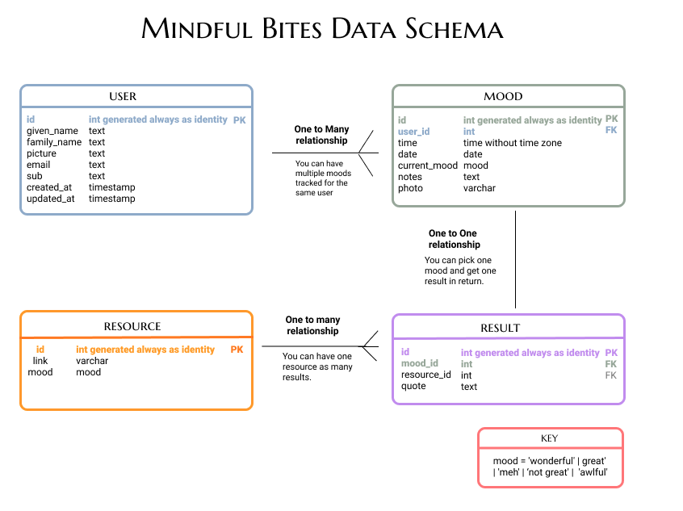
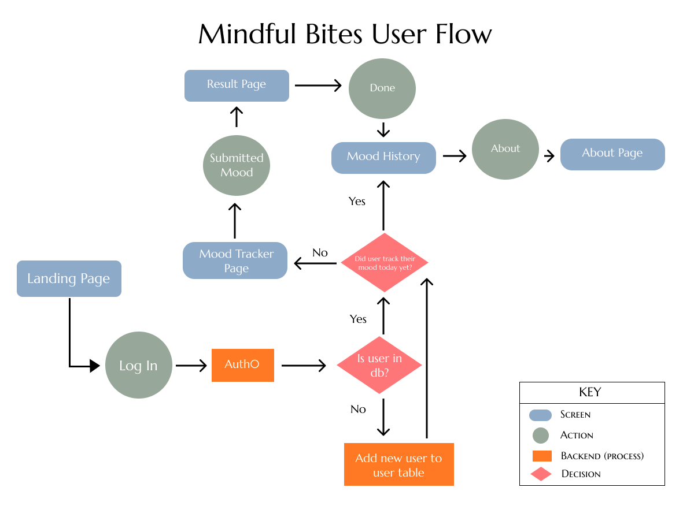
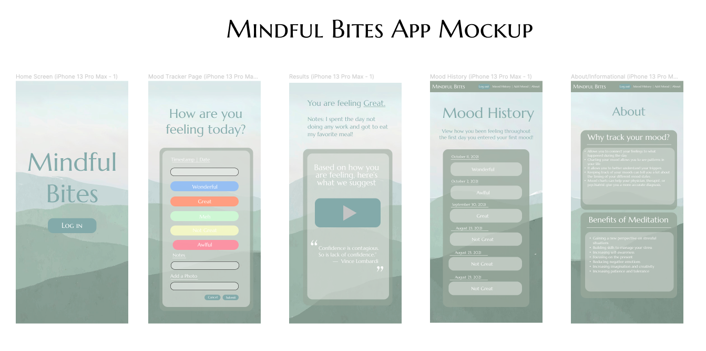

# Mindful Bites


# Overview
Mindful Bites is a web app designed to improve mental health and well being. People are able to track their moods and get guided meditations based on how they are feeling.

<i>Feel free to view Mindful Bites on <a href="https://mindfulbites.herokuapp.com/" target="_blank" rel="noopener noreferrer">Heroku</a>.</i>

# Installation Process


###  Prerequisites
<p>This project relies on Docker to run the PostgreSQL server. You must install Docker first before continuing.

Use one of these methods to download Docker:

<ul>
  <li>Use <a href="https://brew.sh/">Homebrew</a> on macOS: brew install --cask docker</li>
  <li><a href="https://docs.docker.com/get-docker/">Follow the instructions on the Docker website</a></li>
</ul>

Once you've installed Docker Desktop, you'll need to launch the app. On macOS, it's located in /Applications/Docker.</p>

### Node and npm
<p>You'll need to install Node v14 and npm v8 or above.</p>


## Fork and Git Clone or Create a New Repository 
<p>Fork and learn to<a href="https://docs.github.com/en/repositories/creating-and-managing-repositories/cloning-a-repository"> Git Clone</a> my repository</p>
<p><a href="https://github.com/gsong/express-react-project-starter/generate">Generate a new repository </a>from this project.</p>
<p>See GitHub documentation for <a href="https://docs.github.com/en/repositories/creating-and-managing-repositories/creating-a-repository-from-a-template">more details.</a></p>


# Set Up the Development Environment
1. If you haven't already, run Docker

2. If you haven't already, fork and clone this repository

3. Then create a .env file in the app/ directory & add these lines:
```REACT_APP_AUTH0_DOMAIN=<copy/paste your api key here>
REACT_APP_AUTH0_CLIENT_ID=<copy/paste your api key here>
REACT_APP_AUTH0_AUDIENCE=<copy/paste your api key here>
```
4. In your command line interface, in the root directory...

<b> Install and Run NPM Packages</b>
```sh
npm install
```
5. Navigate into /app with ```cd app``` & run ```npm install```

6. Navigate back to the root directory & run ```npm run db:init```

<b>Start the Development Environment</b>
```sh
npm start
```
<b>You should see the development environment display on <a href="http://localhost:3000"></a>http://localhost:3000.</b>

# Shut Down the Development Environment
1. `Ctrl-C` to stop the Express and React development servers.
1. `npm stop` to stop and destroy the PostgreSQL Docker container. Don't worry,
   your data is safe.

# Test the Web App on Heroku
<p>Here are some designated test users you can log in with to try out this app. 
 </p>

<p><b>Dylan Miles</b></p>
<p><b>Email: </b>dylmiles160@gmail.com</p>
<p><b>Password: </b>dAFP?7\'</p>
<p>Date of Birth: February 12, 2005</p>
 <p><b>Bio:</b> Dylan Miles is a high school student at Oakridge High School. His school social worker recommended to use Mindful Bites to track his moods to understand his triggers more of when they tend to feel more anxious during the day.</p>

 
 <p><b>Diana Kim</b></p>
<p><b>Email: </b>dianalinkim@gmail.com</p>
<p><b>Password: </b>>y8W6J(S</p>
<p>Date of Birth: November 8, 1991</p>
 <p><b>Bio:</b> Being a working adult, even after work Diana still felt stressed! She wondered why?! Diana started tracking her mood and started meditation. She found that the app helped managed her stress and helped her identify her triggers for when she felt stressed during meetings at work. </p>

# Tech Stack (PERN)
<h3><b> Tools </b></h3>
<ul>
  <li>Chrome Developer Tools</li>
  <li>VS Code</li>
  <li>TDD (Jest & RTL)</li>
  <li>Scrum</li>
  <li>Terminal</li>
  <li>Git</li>
  <li>GitHub</li>
</ul>

<h3><b> Languages </b></h3>
<ul>
  <li>HTML</li>
  <li>CSS</li>
  <li>JavaScript</li>
</ul>

<h3><b> Frameworks </b></h3>
<ul>
  <li>PostgreSQL</li>
  <li>Express</li>
  <li>React.js</li>
  <li>Node.js</li>
</ul>

# MVP (Minimal Viable Product)
<ul>
  <li>User registration</li>
  <li>Form that tracks mood</li>
  <li>User receives a guided meditation based on mood entered</li>
</ul>

# Nice to Haves
<ul>
  <li>Add note component to mood tracker form</li>
  <li>Add photo component to mood tracker form</li>
  <li>Goals tracker</li>
  <li>Journal entry component</li>
  <li>Metrics gathering through like and dislike buttons </li>
  <li>Mood chart </li>
  <li>Export/downloaded mood history </li>
</ul>

# Data Schema

 

 # Userflow
 

 # Wireframe
 
<h6><i>Lotus icon by <a href="https://icons8.com/icon/WHysRa6y4Q4d/lotus">Icons8</a></i></h6>

# Contributors ✨

Thanks goes to these wonderful people ([emoji key](https://allcontributors.org/docs/en/emoji-key)):

<!-- ALL-CONTRIBUTORS-LIST:START - Do not remove or modify this section -->
<!-- prettier-ignore-start -->
<!-- markdownlint-disable -->
<table>
  <tr>
    <td align="center"><a href="https://github.com/aedward8"><br /><sub><b>Abigail Edwards</b></sub></a><br /><a href="https://github.com/gsong/express-react-project-example/issues?q=author%3Aaedward8" title="Bug reports">🐛</a> <a href="#ideas-aedward8" title="Ideas, Planning, & Feedback">🤔</a> <a href="#question-aedward8" title="Answering Questions">💬</a> <a href="#userTesting-aedward8" title="User Testing">📓</a></td>
    <td align="center"><a href="http://blog.ndpsoftware.com/"><br /><sub><b>Andrew Peterson</b></sub></a><br /><a href="https://github.com/gsong/express-react-project-example/commits?author=ndp" title="Code">💻</a> <a href="#mentoring-ndp" title="Mentoring">🧑‍🏫</a></td>
    <td align="center"><a href="https://github.com/carbonsoda"><br /><sub><b>Avery</b></sub></a><br /><a href="#infra-carbonsoda" title="Infrastructure (Hosting, Build-Tools, etc)">🚇</a> <a href="https://github.com/gsong/express-react-project-example/pulls?q=is%3Apr+reviewed-by%3Acarbonsoda" title="Reviewed Pull Requests">👀</a> <a href="#userTesting-carbonsoda" title="User Testing">📓</a></td>
    <td align="center"><a href="https://github.com/sunnybrie"><br /><sub><b>Brie Klassen</b></sub></a><br /><a href="https://github.com/gsong/express-react-project-example/issues?q=author%3Asunnybrie" title="Bug reports">🐛</a> <a href="https://github.com/gsong/express-react-project-example/commits?author=sunnybrie" title="Documentation">📖</a> <a href="#ideas-sunnybrie" title="Ideas, Planning, & Feedback">🤔</a> <a href="#question-sunnybrie" title="Answering Questions">💬</a> <a href="https://github.com/gsong/express-react-project-example/pulls?q=is%3Apr+reviewed-by%3Asunnybrie" title="Reviewed Pull Requests">👀</a> <a href="#userTesting-sunnybrie" title="User Testing">📓</a></td>
    <td align="center"><a href="https://github.com/gsong"><br /><sub><b>George Song</b></sub></a><br /><a href="https://github.com/gsong/express-react-project-example/commits?author=gsong" title="Code">💻</a> <a href="https://github.com/gsong/express-react-project-example/commits?author=gsong" title="Documentation">📖</a> <a href="#infra-gsong" title="Infrastructure (Hosting, Build-Tools, etc)">🚇</a> <a href="#maintenance-gsong" title="Maintenance">🚧</a></td>
    <td align="center"><a href="https://github.com/jenhuynh"><br /><sub><b>Jen Huynh</b></sub></a><br /><a href="https://github.com/gsong/express-react-project-example/issues?q=author%3Ajenhuynh" title="Bug reports">🐛</a> <a href="#userTesting-jenhuynh" title="User Testing">📓</a></td>
    <td align="center"><a href="https://github.com/m3ia"><br /><sub><b>Meia</b></sub></a><br /><a href="https://github.com/gsong/express-react-project-example/commits?author=m3ia" title="Documentation">📖</a></td>
  </tr>
  <tr>
    <td align="center"><a href="https://github.com/Shaylan7"><br /><sub><b>Shaylan7</b></sub></a><br /><a href="https://github.com/gsong/express-react-project-example/issues?q=author%3AShaylan7" title="Bug reports">🐛</a></td>
    <td align="center"><a href="https://www.tabbykatz.com/"><br /><sub><b>Tabitha O'Melay</b></sub></a><br /><a href="https://github.com/gsong/express-react-project-example/issues?q=author%3Atabbykatz" title="Bug reports">🐛</a> <a href="#question-tabbykatz" title="Answering Questions">💬</a> <a href="https://github.com/gsong/express-react-project-example/pulls?q=is%3Apr+reviewed-by%3Atabbykatz" title="Reviewed Pull Requests">👀</a></td>
    <td align="center"><a href="https://github.com/talarsen"><br /><sub><b>Tara Larsen</b></sub></a><br /><a href="https://github.com/gsong/express-react-project-example/issues?q=author%3Atalarsen" title="Bug reports">🐛</a></td>
    <td align="center"><a href="https://github.com/xiaozhong21"><br /><sub><b>Xiao Zhong</b></sub></a><br /><a href="#question-xiaozhong21" title="Answering Questions">💬</a> <a href="#userTesting-xiaozhong21" title="User Testing">📓</a> <a href="https://github.com/gsong/express-react-project-example/issues?q=author%3Axiaozhong21" title="Bug reports">🐛</a></td>
    <td align="center"><a href="https://github.com/ZelmaSedano"><br /><sub><b>ZelmaSedano</b></sub></a><br /><a href="#tutorial-ZelmaSedano" title="Tutorials">✅</a></td>
  </tr>
</table>

<!-- markdownlint-restore -->
<!-- prettier-ignore-end -->

<!-- ALL-CONTRIBUTORS-LIST:END -->

This project follows the [all-contributors](https://github.com/all-contributors/all-contributors) specification. Contributions of any kind welcome!